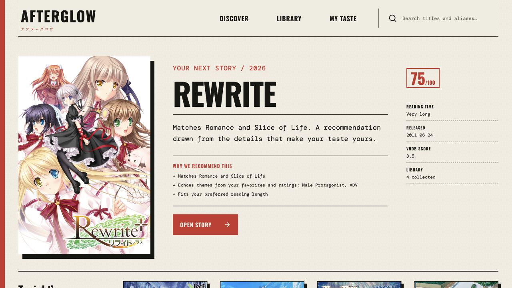
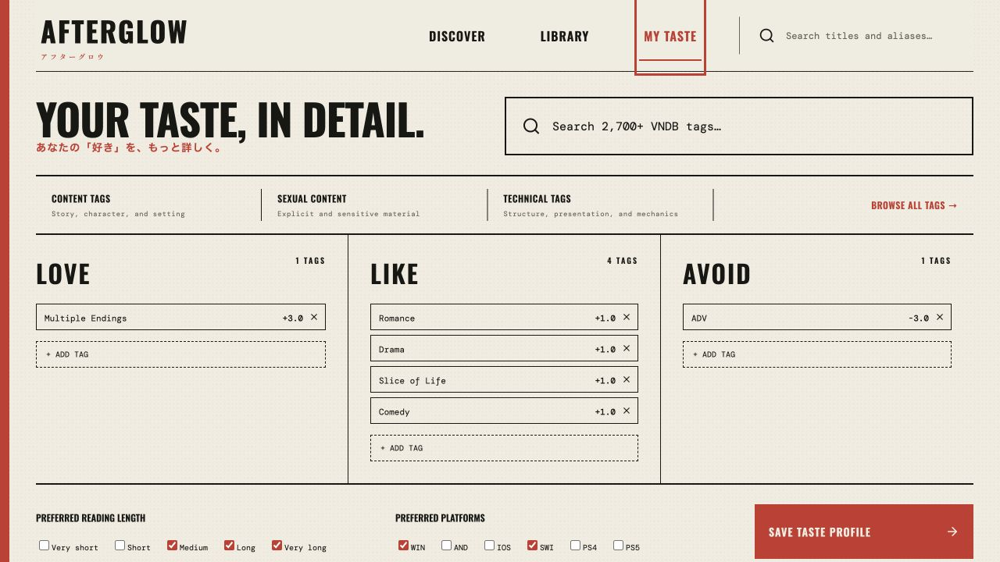

# Afterglow

A local-first visual novel discovery app powered by VNDB. Search titles, build a personal library, search VNDB's full tag catalogue, set weighted taste preferences, and get explainable recommendations.



Recommendations combine manual tag weights with each title's VNDB tag relevance, reading-length and platform preferences, VNDB ratings, and signals learned from favorites, ratings, completed stories, and dropped titles.

## Screenshots

Screenshots use sample data.

### Shape your taste profile



## Start

Requires Node.js 22 or newer.

```bash
npm install
npm run dev
```

Open `http://localhost:5173`. Personal data is stored locally in `data/afterglow.db` and no account or API key is required.

## Checks

```bash
npm run typecheck
npm test
npm run build
```

VN metadata is provided by the [VNDB Kana API](https://api.vndb.org/kana) and remains subject to its terms and data license.
