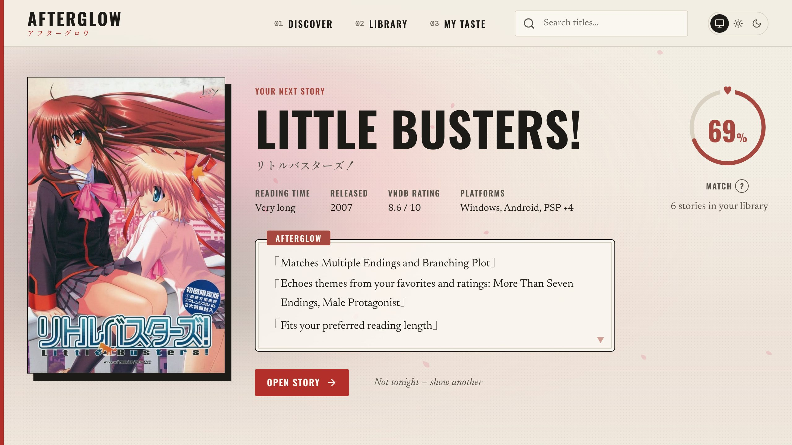
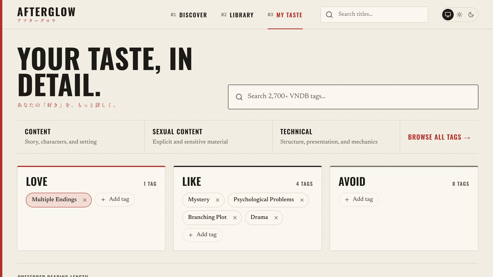

# Afterglow

A local-first visual novel discovery app powered by VNDB. Search titles, build a personal library, search VNDB's full tag catalogue, set weighted taste preferences, and get explainable recommendations.

Discover supports paginated results, platform and reading-length filters, release years, minimum ratings, and sorting. Your library can be searched by title or private notes, filtered by reading status and favorites, and sorted by rating, progress, title, or recent updates.

The interface comes in light, dark, and system themes. Its decorative motion (page eyecatches, cover glows, drifting petals and light, the typewriter "why it fits you" box) switches off when your device asks for reduced motion.

Recommendations combine manual tag weights with each title's VNDB tag relevance, reading-length and platform preferences, VNDB ratings, and signals learned from favorites, ratings, completed stories, and dropped titles.

## Screenshots

### Discover your next story



### Shape your taste profile



## Start

Requires Node.js 22 or newer.

```bash
npm install
npm run dev
```

Open `http://localhost:5173`. Personal data is stored locally in `data/afterglow.db` and no account or API key is required.

To run the built app from a single server instead:

```bash
npm run build
npm start
```

Then open `http://127.0.0.1:3001`. The API has no accounts, so it only listens on `127.0.0.1` by default. Set `HOST`, `PORT`, or `AFTERGLOW_DATA_DIR` to change the address, port, or database folder.

## Checks

```bash
npm run format:check
npm run lint
npm run typecheck
npm test
npm run build
```

Run `npm run format` to apply Prettier formatting.

## Screenshots

The README screenshots come from your own running copy, so they show real covers:

```bash
npm run build && npm start   # in one terminal
npm run screenshots          # in another; add -- --theme=dark for dark mode
```

The first run may ask you to install Chromium with `npx playwright install chromium`. The images include your library and taste profile, so look them over before committing.

VN metadata is provided by the [VNDB Kana API](https://api.vndb.org/kana) and remains subject to its terms and data license.
